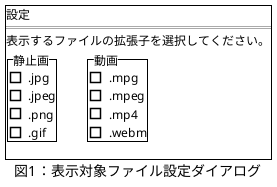

# 要求仕様書 v1.4.0

パンくずリスト：[トップページ](../index.html) - 要求仕様書 v1.4.0

更新者：DNV825
更新日：2021/11/24(Wed) 00:50

## 実現する機能の説明

1. 表示する拡張子を選択可能にする。

## 実現する機能の要求

@import "../ref/要求仕様書v1.4.0_要求する内容.csv"

## やったことと不足していること

- 要求No.1、2、3、5は完了。
- 要求No.4は方法がわからないのと、更新しなくても問題はないのでいったん諦める。
- ユーザー設定の保存場所は以下の通り。
`C:\Users\<ユーザー名>\AppData\Local\<会社名>\<アプリケーション名>.exe_Url_<ハッシュ値>\<バージョン>\user.config`

参考サイト：

ダイアログ表示

- <https://araramistudio.jimdo.com/2019/11/05/c-%E3%81%AEwpf%E3%81%A7%E3%83%A1%E3%83%8B%E3%83%A5%E3%83%BC%E3%82%92%E4%BD%9C%E6%88%90%E3%81%99%E3%82%8B/>
- <https://docs.microsoft.com/ja-jp/dotnet/desktop/wpf/windows/how-to-open-window-dialog-box?view=netdesktop-6.0>
- <https://anderson02.com/cs/wpf/wpf-17/>
- <https://docs.microsoft.com/ja-jp/dotnet/desktop/wpf/windows/how-to-close-window-dialog-box?view=netdesktop-6.0>
- <https://www.doraxdora.com/blog/2017/08/18/post-2073/>

ユーザー設定

- <https://docs.microsoft.com/ja-jp/dotnet/desktop/winforms/advanced/using-application-settings-and-user-settings?view=netframeworkdesktop-4.8>
- <https://docs.microsoft.com/ja-jp/dotnet/desktop/winforms/advanced/application-settings-overview?view=netframeworkdesktop-4.8>
- <https://docs.microsoft.com/ja-jp/dotnet/desktop/winforms/advanced/how-to-create-application-settings?view=netframeworkdesktop-4.8>
- <https://se-naruhodo.com/paramsettings/>
- <https://so-zou.jp/software/tech/programming/c-sharp/deploying/application-settings.htm>
- <https://yoshinorin.net/2016/06/10/wpf-settings/>
- <https://docs.microsoft.com/ja-jp/dotnet/desktop/winforms/controls/how-to-respond-to-windows-forms-checkbox-clicks?view=netframeworkdesktop-4.8>
- <https://blog.hiros-dot.net/?page_id=3531>
- <https://araramistudio.jimdo.com/2016/10/12/wpf%E3%81%A7window%E3%82%92%E9%96%89%E3%81%98%E3%82%8B%E5%89%8D%E3%81%AB%E7%A2%BA%E8%AA%8D%E3%81%99%E3%82%8B/>
