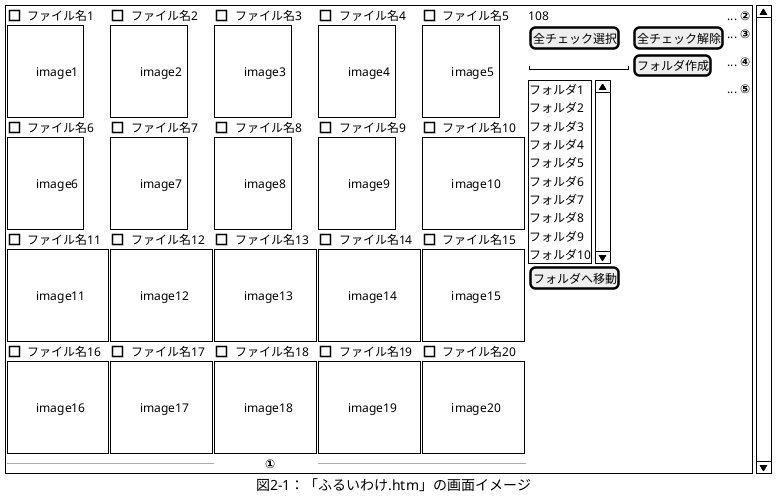
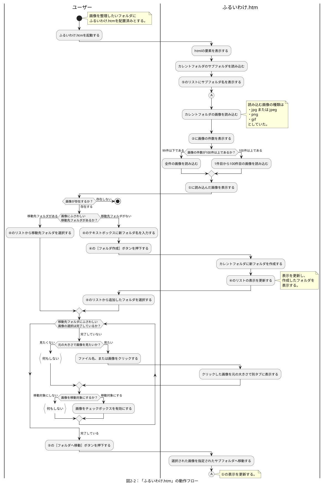

# やりたいこと

更新者：DNV825
更新日：2021/10/25(Mon) 01:28

## 目的

1. 2007年ごろに作った「ふるいわけ.htm」と同等の機能をC\# & WPFで再現する（※1）
1. 出来上がったものをブラッシュアップする。

※1：MAUIというのもこれから出てくるらしいが、とりあえずWPFでやってみる。

## 「ふるいわけ.htm」とは

「ふるいわけ.htm」はInternet ExplorerとActiveX（FileSystmeObject）で作成したアプリで、

- htmlファイルと同じフォルダに配置された画像ファイルを一覧表示し、選んだ画像をサブフォルダへ移動する

ことを目的としている。

ファイルのタイムスタンプは2007/10/18なので、14年近く前の古いスクリプトではあるが、2021年現在も問題なく動作する。

しかし、Windows 10で動作するInternet Explorerは2022/06/16（日本時間）にサポートが終了するので、同等の機能を別の手段で実現したい（そういうツールは誰かが作っていそうだが、探すのも面倒くさい。）

### 「ふるいわけ.htm」の画面仕様

「ふるいわけ.htm」は以下のように画面を表示する。

| 番号 | 表示内容の説明 |
| --- | --- |
| ① | ファイル名と画像を表示するエリア。画像の縦横サイズは固定値に変換して表示する。ファイル名の左にチェックボックスを表示し、チェックしたファイルを移動対象とする。ファイル名・画像はハイパーリンクになっており、クリックすると元画像を表示する。 |
| ② | フォルダ内に存在する画像の件数を表示するエリア。どのファイルが画像ファイルであるかは拡張子で判別している。 |
| ③ | チェックボックスの全選択・全解除を行うボタン。 |
| ④ | 移動先フォルダとなるフォルダを作成するエリア。テキストボックスに入力した名前でカレントフォルダに新フォルダを作成する。 |
| ⑤ | 画像の移動先フォルダを選択するリストと、選択したフォルダへ画像を移動するボタン。 |

### 「ふるいわけ.htm」の動作

「ふるいわけ.htm」の動作フローは以下の通り。

